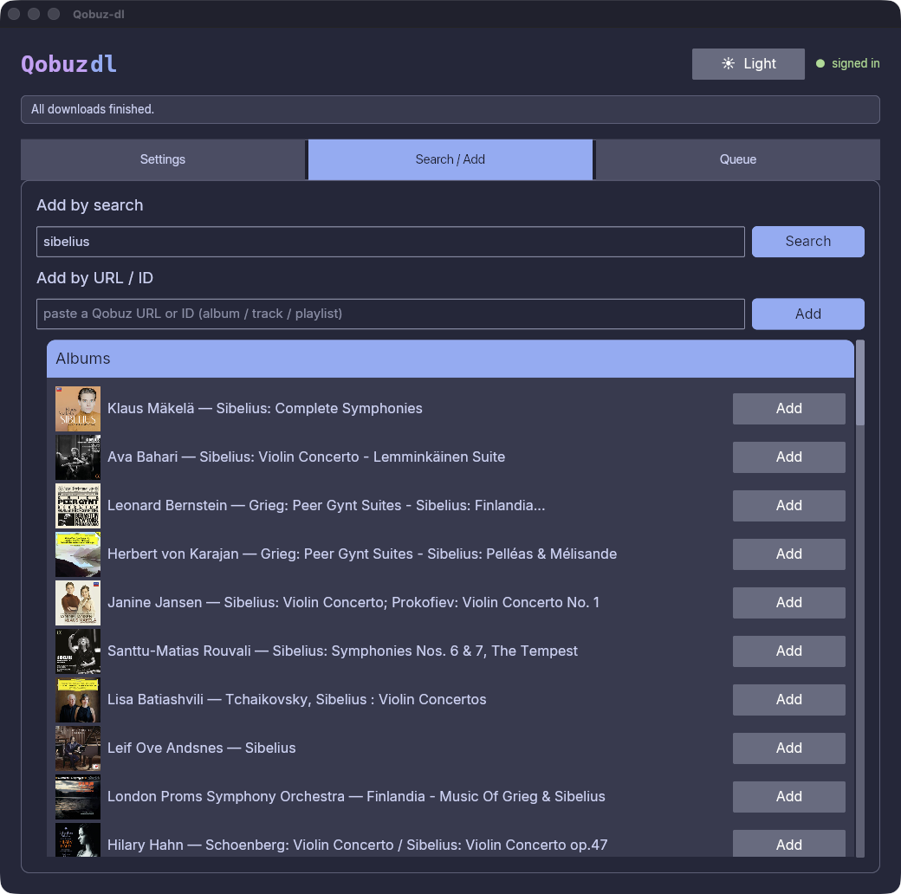
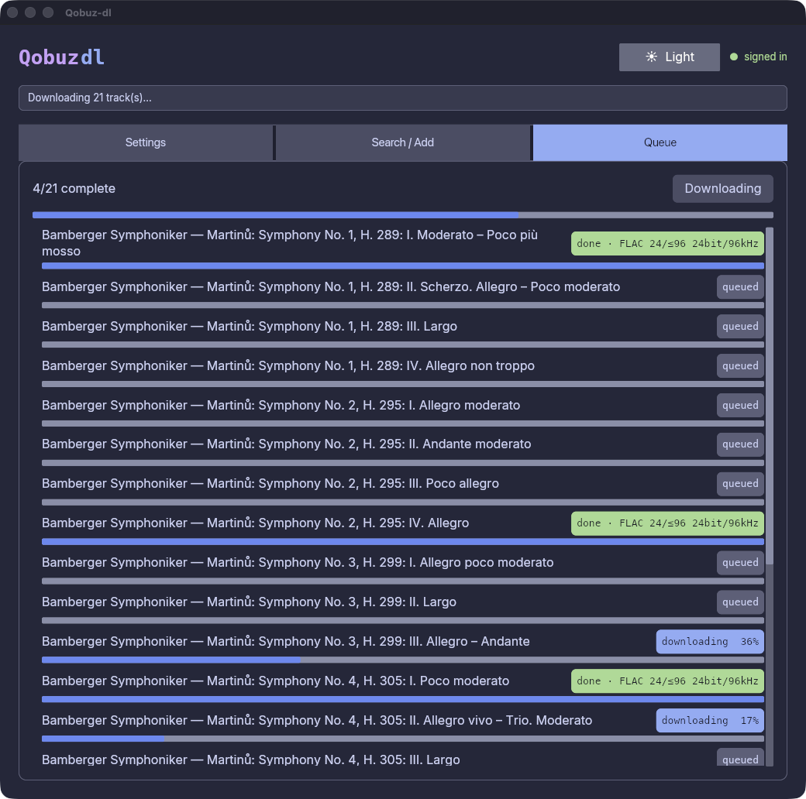
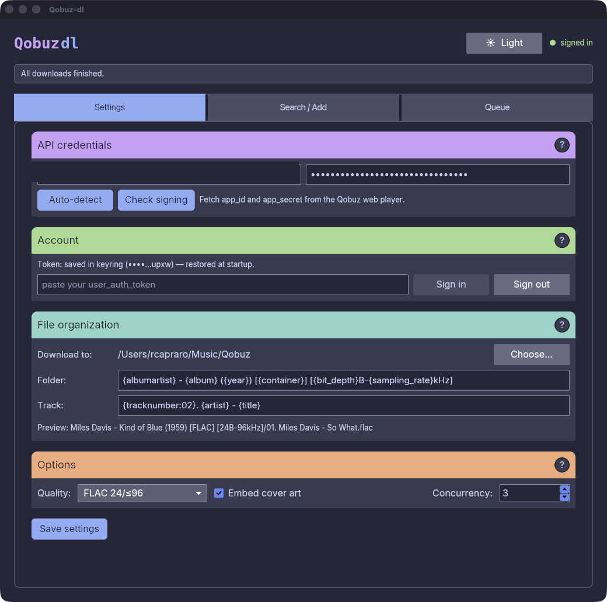

# Qobuz-dl

[](https://github.com/rcapraro/Qobuz-dl/releases/latest)
[](#)

A cross-platform desktop application (Rust + [iced](https://iced.rs)) to
download music from Qobuz for a subscriber's own offline use — with control over
quality, cover art, file organization, and tags.

> Intended for downloading content you are entitled to via a valid paid Qobuz
> account. You are responsible for complying with Qobuz's terms of service.



## Features

- Authenticate with your Qobuz **`user_auth_token`** (see [Signing in](#signing-in)).
- Choose download **quality**: MP3 320, FLAC 16/44.1, FLAC 24/≤96, FLAC 24/≤192.
- **Embed cover art** into downloaded files.
- Configurable **download directory** and **folder/track path templates**.
- Full audio **tag** writing (FLAC / MP3 / M4A).
- Find music by **search** or by pasting a **Qobuz URL / ID** (album, track, playlist).
- **Download queue** with per-item progress, bounded concurrency, and retry.

## Screenshots

| Search | Queue | Settings |
| --- | --- | --- |
|  |  |  |

*Search for albums, tracks, or playlists — or paste a Qobuz URL. The queue shows
per-track progress with retry for failed items. Settings hold your credentials,
quality preference, and path templates.*

## Installation

Prebuilt packages for every release are on the
[**GitHub Releases**](https://github.com/rcapraro/Qobuz-dl/releases/latest) page:

| Platform | Artifact |
| --- | --- |
| macOS | `.dmg` |
| Windows | NSIS installer (`.exe`) |
| Linux | `.AppImage` / `.deb` |

**Linux runtime notes:** the app needs a Secret Service provider (e.g. GNOME
Keyring) for secure token storage, plus GTK for native file dialogs.

To build from source instead, see [Build from source](#build-from-source).

After installing you'll need, in **Settings**:

- A Qobuz `app_id` and `app_secret` — press **Auto-detect** to pull them from
  the Qobuz web player automatically, or paste them manually.
- A Qobuz `user_auth_token` for sign-in (see [Signing in](#signing-in)).

## Signing in

Sign-in uses your account's **`user_auth_token`**. Email/password login is not
supported: Qobuz's login endpoint rejects it for partner/bundled accounts (for
example Qobuz obtained through a telecom or hi-fi brand), which have no
Qobuz-native password.

To obtain your token from the Qobuz web player:

1. Open [play.qobuz.com](https://play.qobuz.com) in a browser and sign in normally.
2. Open the browser developer tools (`F12` / `⌥⌘I`) and select the **Network** tab.
3. Reload the page, click any request to the Qobuz API, and read the request
   header **`x-user-auth-token`**.
4. Copy that value, paste it into the **Account** section in the app's Settings,
   and press **Sign in**.

The token is stored in your OS keyring (see [Configuration](#configuration)); you
only need to do this once unless you sign out or the token is revoked.

## Usage

1. **Sign in** once in Settings (see [Signing in](#signing-in)) and pick your
   preferred **quality** — if Qobuz serves a lower quality than requested, the
   app tags and names the file by what was actually delivered.
2. **Find music** on the Search screen: type a query, or paste a Qobuz **URL or
   ID** for an album, track, or playlist.
3. **Queue downloads** — each track appears in the Queue with live progress;
   failed items can be retried.
4. **Files land** in your configured download directory, organized by the
   folder/track **path templates** (e.g. `{artist}/{album}` /
   `{track_number} - {title}`), with tags and cover art embedded.

## Build from source

Requires Rust (stable) — [`rustup`](https://rustup.rs) recommended.

```bash
# Run the GUI (debug)
cargo run -p qobuz-gui

# Build everything
cargo build --workspace

# Run core tests
cargo test -p qobuz-core

# Optimized release build
cargo build --release -p qobuz-gui
```

Cargo workspace layout:

- `crates/qobuz-core` — API client + download engine (no UI dependencies).
- `crates/qobuz-gui` — the `iced` desktop application.

## Packaging

Install [`cargo-packager`](https://github.com/crabnebula-dev/cargo-packager) and
run `cargo packager --release` from `crates/qobuz-gui/` to produce macOS
`.dmg`/`.app`, Windows NSIS `.exe`, and Linux `.AppImage`/`.deb` bundles. The
packaging config lives in `[package.metadata.packager]` in
`crates/qobuz-gui/Cargo.toml`. Releases are also built automatically by CI on a
`v*` git tag (see `.github/workflows/release.yml`).

## Configuration

Non-secret settings persist as JSON under your platform config directory
(via the `directories` crate). The `user_auth_token` is stored in the OS keyring
(macOS Keychain / Windows Credential Manager / Linux Secret Service) and is
**never** written to the config file.

### macOS: keychain re-prompts in development

`cargo build`/`cargo run` produce an **ad-hoc–signed** binary whose code hash
changes on every rebuild. macOS grants Keychain access per code-identity, so each
rebuild is seen as a *new* app: it re-prompts for keychain access and "Always
Allow" never sticks — the stored token then looks like it "didn't save". A
properly signed release `.app` does not have this problem.

To make the trust persist across rebuilds while developing, sign the dev binary
with a **stable self-signed identity**:

1. One-time: create a self-signed **Code Signing** certificate named
   `Qobuz-dl Dev` via *Keychain Access → Certificate Assistant → Create a
   Certificate…* (Identity Type: *Self Signed Root*, Certificate Type: *Code
   Signing*).
2. Build, sign, and run with the helper (signs with that identity; override the
   name via `QOBUZ_DL_SIGN_ID`):
   ```bash
   ./scripts/dev-run.sh            # build + stable-sign + run
   # or, after a manual build:
   ./scripts/dev-sign.sh target/debug/qobuz-dl
   ```
3. The first run still prompts once — click **Always Allow**. Because the signing
   identity and identifier (`com.qobuzdl.qobuz-dl`) are now stable, that choice
   persists across future rebuilds.
