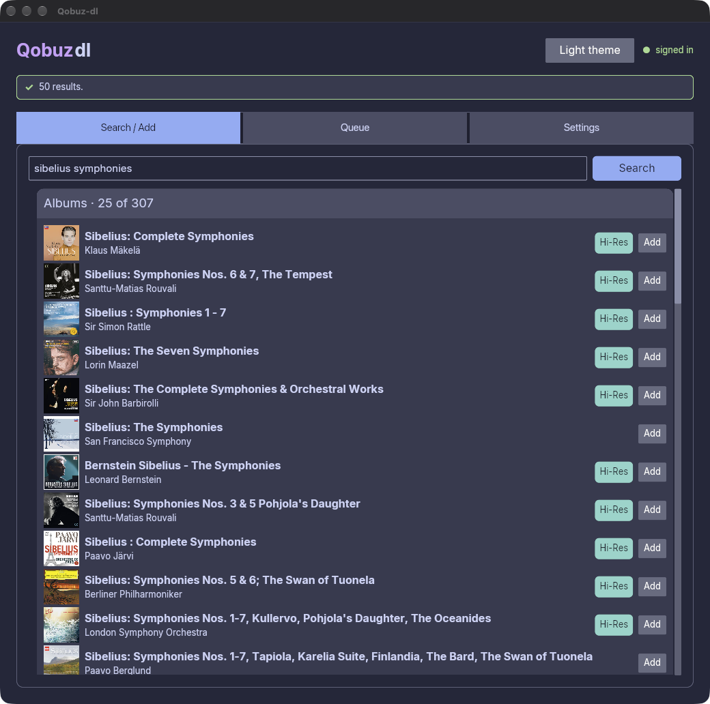
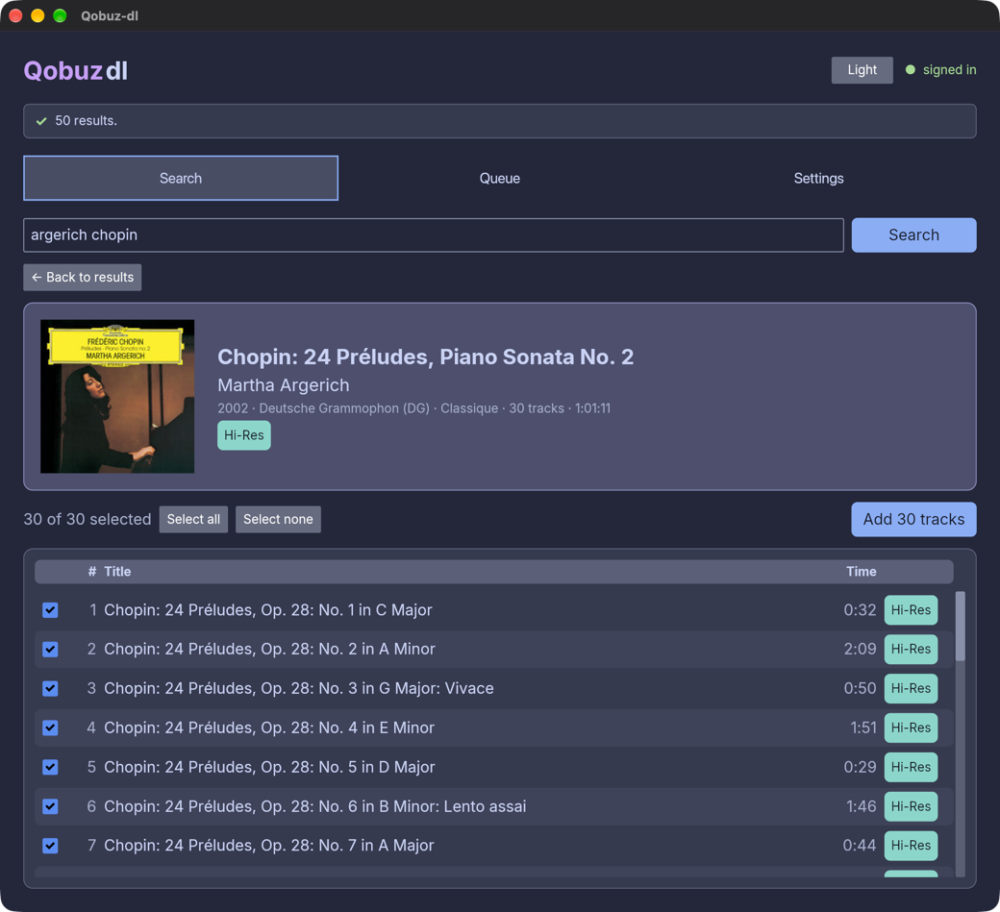
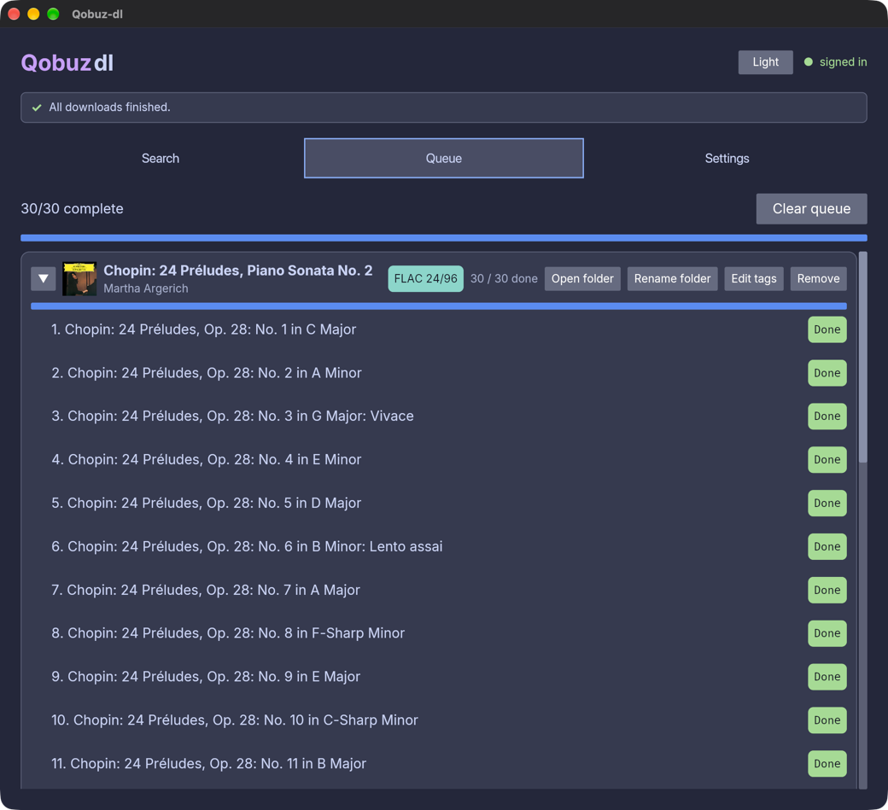
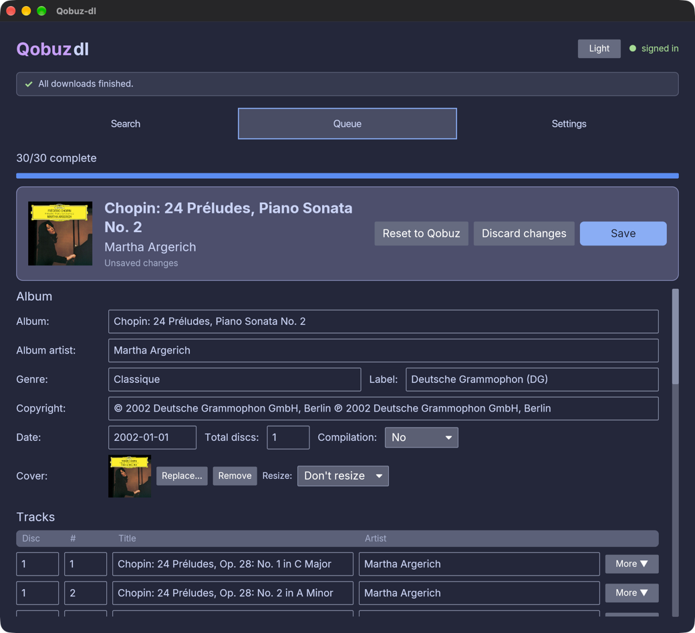
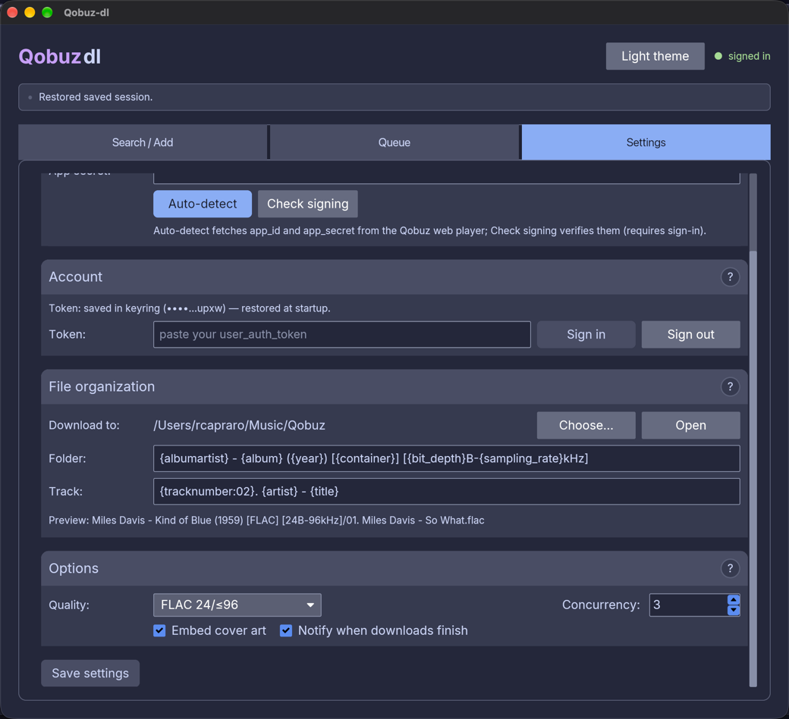

# Qobuz-dl

[](https://github.com/rcapraro/Qobuz-dl/releases/latest)
[](#)

A cross-platform desktop application (Rust + [iced](https://iced.rs)) to
download music from Qobuz for a subscriber's own offline use — with control over
quality, cover art, file organization, and tags.

> Intended for downloading content you are entitled to via a valid paid Qobuz
> account. You are responsible for complying with Qobuz's terms of service.



## Features

- Authenticate with your Qobuz **`user_auth_token`** (see [Signing in](#signing-in)).
- Choose download **quality**: MP3 320, FLAC 16/44.1, FLAC 24/≤96, FLAC 24/≤192.
- **Embed cover art** into downloaded files at 400, 500 or 600 px, or not at all.
- Configurable **download directory** and **folder/track path templates**.
- Full audio **tag** writing (FLAC / MP3 / M4A), from title and track number to
  release date, label, copyright, ISRC and the explicit flag (see [Tags](#tags)).
- **Edit the tags** of a downloaded album from the queue: album fields once, each
  track's own fields, and the cover, saved without touching other tags.
- **Rename an album's folder** from the queue, with a name suggested from its tags.
- Find music by **search** — albums and tracks page independently with **Show more** — or by pasting a **Qobuz URL / ID** (album, track, playlist).
- **Open an album** from search to see its track list and add only the tracks you pick.
- **Download queue** with per-item progress, bounded concurrency, and retry, and a
  **desktop notification** when a batch finishes while the app is in the background.
- **Open the downloaded files** from the queue, one album folder at a time.
- **Keyboard shortcuts**: `/` to search, Ctrl+Tab / Ctrl+Shift+Tab to switch tabs, Esc to leave an album, ⌘↵ (Ctrl+Enter elsewhere) to add its selected tracks.

## Screenshots

| Search | Album | Queue | Tag editor | Settings |
| --- | --- | --- | --- | --- |
|  |  |  |  |  |

*Search for albums and tracks, or paste a Qobuz URL. Open an album to pick the
tracks you want. The queue groups downloads by album, with per-track status,
retry for failed tracks, and actions to open, rename or retag each finished
album. The tag editor shows the files' tags, album fields once and each track's
own. Settings hold your credentials, path and rename templates, quality, cover
size, and notifications.*

## Installation

Prebuilt packages for every release are on the
[**GitHub Releases**](https://github.com/rcapraro/Qobuz-dl/releases/latest) page:

| Platform | Artifact |
| --- | --- |
| macOS | `.dmg` |
| Windows | NSIS installer (`.exe`) |
| Linux | `.AppImage` / `.deb` |

**Linux runtime notes:** the app needs a Secret Service provider (e.g. GNOME
Keyring) for secure token storage, plus GTK for native file dialogs.

To build from source instead, see [Build from source](#build-from-source).

After installing you'll need, in **Settings**:

- A Qobuz `app_id` and `app_secret` — press **Auto-detect** to pull them from
  the Qobuz web player automatically, or paste them manually.
- A Qobuz `user_auth_token` for sign-in (see [Signing in](#signing-in)).

## Signing in

Sign-in uses your account's **`user_auth_token`**. Email/password login is not
supported: Qobuz's login endpoint rejects it for partner/bundled accounts (for
example Qobuz obtained through a telecom or hi-fi brand), which have no
Qobuz-native password.

To obtain your token from the Qobuz web player:

1. Open [play.qobuz.com](https://play.qobuz.com) in a browser and sign in normally.
2. Open the browser developer tools (`F12` / `⌥⌘I`) and select the **Network** tab.
3. Reload the page, click any request to the Qobuz API, and read the request
   header **`x-user-auth-token`**.
4. Copy that value, paste it into the **Account** section in the app's Settings,
   and press **Sign in**.

The token is stored in your OS keyring (see [Configuration](#configuration)); you
only need to do this once unless you sign out or the token is revoked.

## Usage

1. **Sign in** once in Settings (see [Signing in](#signing-in)) and pick your
   preferred **quality** — if Qobuz serves a lower quality than requested, the
   app tags and names the file by what was actually delivered. Until setup is
   complete, the Search screen says what is missing and links to Settings.
2. **Find music** on the Search screen, which the app opens on. One field does
   both: type a query to search, or paste a Qobuz **URL** for an album, track,
   or playlist to add it directly. A query that is also a valid bare **ID** is
   searched, with an extra action to add it by ID. **Add** on an album queues
   all of it. Click its title or cover instead to open the album, check the
   tracks you want, and add only those. **Back** returns to your results.
3. **Queue downloads** — tracks are grouped under their album in the Queue,
   each group with its cover, a done count, the quality it was delivered in,
   and its own progress bar, and the Queue tab shows how many tracks are still
   to process. A track delivered at a different quality from its album shows
   its own. Groups can be collapsed, and **Retry failed** relaunches failed
   tracks. When no batch is running, **Remove** on an album group takes it out
   of the list; files on disk are never deleted. **Open folder** on an album
   opens its downloaded files in your file manager. Settings has an
   **Open** button next to the download directory.
4. **Files land** in your configured download directory, organized by the
   folder/track **path templates** (e.g. `{artist}/{album}` /
   `{tracknumber:02} - {title}`), with tags and cover art embedded. Only the
   template's own `/` makes folders: one inside a value, as in "AC/DC", is
   replaced by a space. Version 2.0.2 and earlier made a folder of it, so an album
   downloaded then lands in a new folder if you download it again.
5. **Fix up tags and folders** once an album is done: **Edit tags** and
   **Rename folder** on its queue group (see [Tags](#tags)).

## Tags

**On download**, each file gets: title, artist, album, album artist, track
number and total, disc number and total, full release date, genre, composer,
ISRC, label, copyright, the explicit flag (`ITUNESADVISORY` in FLAC, `TXXX` in
MP3, `rtng` in M4A) and, unless Cover art is Off, the front cover. Tags are
written into the file before it appears at its destination, and a track already
on disk is left untouched rather than re-tagged.

**Edit tags** on a finished album group opens an editor in place of the queue
list, showing what the files hold now:

- **Album fields** (album, album artist, date, genre, label, copyright, disc
  total, compilation) appear once. Where tracks disagree, the field shows
  **(mixed)** and is left alone unless you type a value.
- **Track fields** (title, artist, track number and total, disc number,
  composer, ISRC, explicit, comment) appear per track, each with **Apply to
  all**. Track total is per track because each disc of a multi-disc album
  counts its own tracks.
- **Genre** suggests the standard ID3v1 genres; dates accept `YYYY`, `YYYY-MM`
  or `YYYY-MM-DD`.
- The **cover** can be replaced from a JPEG or PNG file, removed, or resized to
  400, 500 or 600 px.
- **Reset to Qobuz** refills the fields from the album's Qobuz metadata.
- **Fill from MusicBrainz** finds the album on [MusicBrainz](https://musicbrainz.org)
  by its barcode, by its tracks' ISRCs, or by its title among releases with the
  same number of tracks and discs, and fills the fields from it: the
  original release date, MusicBrainz's most-voted genre, composers and more.
  Explicit, ISRC, copyright and comment are left alone. When several releases
  match, the track list is replaced by a list of them, ranked by a **match**
  percentage that measures how well each fits your files; pick one with
  **Use**. Tick **Include cover** first to also take the release's front cover
  from the Cover Art Archive. **Cancel lookup** stops it at any step without
  changing anything. If fewer than half your tracks match the chosen release,
  only those tracks are filled; the album fields and cover are left alone. The
  app only contacts MusicBrainz when you ask, and sends only the album's
  barcode, ISRCs, title and disc count.

**Save** writes only the fields that changed. Tags outside the list, such as
ReplayGain, are kept, and a file with nothing to change isn't rewritten. Each
file is edited as a copy that then replaces it, one file at a time, so a failure
leaves that file as it was and keeps your edits for another try.

**Rename folder** renames a finished album's folder in place. The name is
suggested from the **rename template** in Settings (default
`{albumartist} - {album} ({year})`), filled from the files' current tags, so a
title fixed in the editor shows up in it; you can type any other name. The
rename is refused, with nothing moved, when the name is taken, the folder holds
another album, or a download is running, and the queue's Open folder and Edit
tags follow the new name. A renamed folder no longer matches the download folder
template, so adding the album again downloads it anew.

## Build from source

Requires Rust (stable) — [`rustup`](https://rustup.rs) recommended.

```bash
# Run the GUI (debug)
cargo run -p qobuz-gui

# Build everything
cargo build --workspace

# Run core tests
cargo test -p qobuz-core

# Optimized release build
cargo build --release -p qobuz-gui
```

Cargo workspace layout:

- `crates/qobuz-core` — API client + download engine (no UI dependencies).
- `crates/qobuz-gui` — the `iced` desktop application.

## Packaging

Install [`cargo-packager`](https://github.com/crabnebula-dev/cargo-packager) and
run `cargo packager --release` from `crates/qobuz-gui/` to produce macOS
`.dmg`/`.app`, Windows NSIS `.exe`, and Linux `.AppImage`/`.deb` bundles. The
packaging config lives in `[package.metadata.packager]` in
`crates/qobuz-gui/Cargo.toml`. Releases are also built automatically by CI on a
`v*` git tag (see `.github/workflows/release.yml`).

## Configuration

Non-secret settings persist as JSON under your platform config directory
(via the `directories` crate). The `user_auth_token` is stored in the OS keyring
(macOS Keychain / Windows Credential Manager / Linux Secret Service) and is
**never** written to the config file.

### macOS: keychain re-prompts in development

`cargo build`/`cargo run` produce an **ad-hoc–signed** binary whose code hash
changes on every rebuild. macOS grants Keychain access per code-identity, so each
rebuild is seen as a *new* app: it re-prompts for keychain access and "Always
Allow" never sticks — the stored token then looks like it "didn't save". A
properly signed release `.app` does not have this problem.

To make the trust persist across rebuilds while developing, sign the dev binary
with a **stable self-signed identity**:

1. One-time: create a self-signed **Code Signing** certificate named
   `Qobuz-dl Dev` via *Keychain Access → Certificate Assistant → Create a
   Certificate…* (Identity Type: *Self Signed Root*, Certificate Type: *Code
   Signing*).
2. Build, sign, and run with the helper (signs with that identity; override the
   name via `QOBUZ_DL_SIGN_ID`):
   ```bash
   ./scripts/dev-run.sh            # build + stable-sign + run
   # or, after a manual build:
   ./scripts/dev-sign.sh target/debug/qobuz-dl
   ```
3. The first run still prompts once — click **Always Allow**. Because the signing
   identity and identifier (`com.qobuzdl.qobuz-dl`) are now stable, that choice
   persists across future rebuilds.

### macOS: notifications in development

The installed `Qobuz-dl.app` posts its "Downloads finished" notifications under
its own name and icon. A development binary is not an installed app bundle, so
macOS attributes its notifications to **Finder** instead. That is expected; to
see them at all, allow notifications for Finder in *System Settings →
Notifications*.
